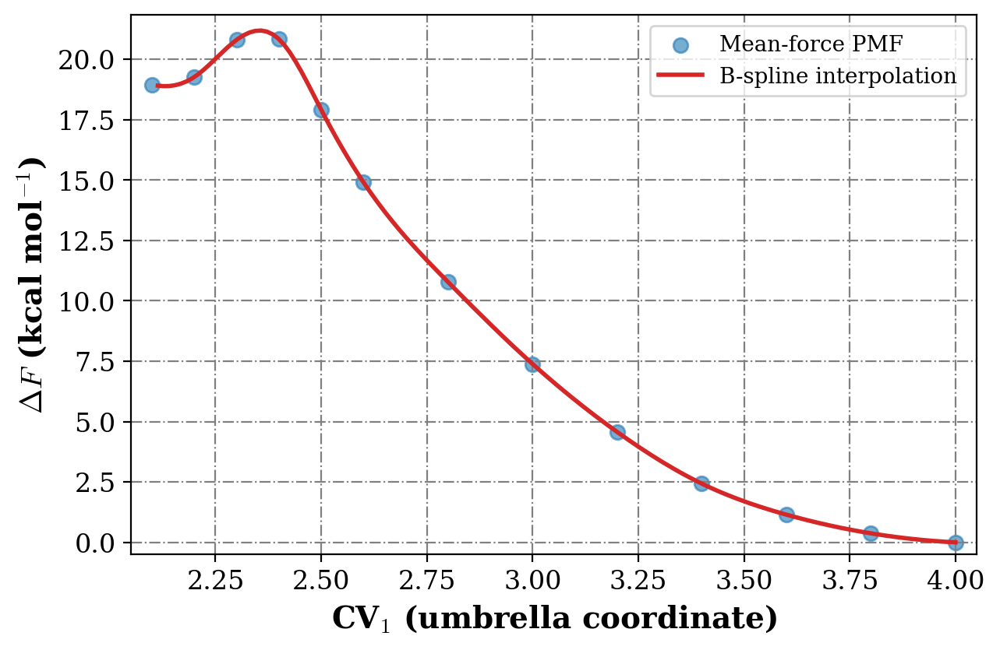
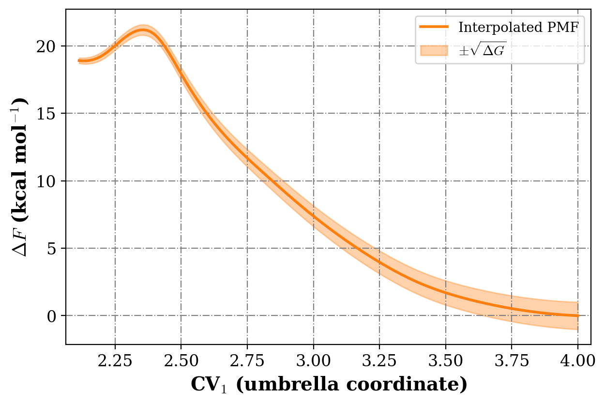
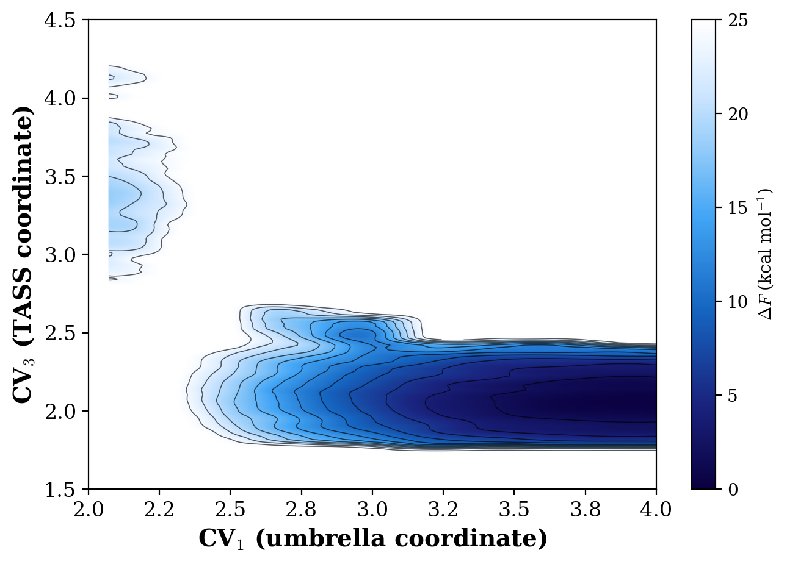
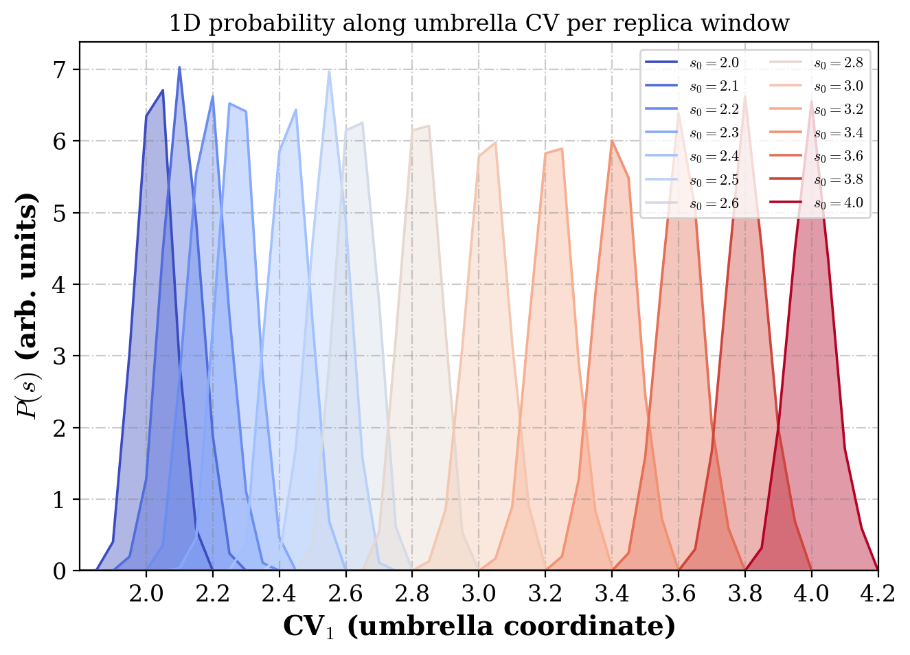

Hands-on example
================

This tutorial walks through the **bundled example** in the ``example/`` directory
of the repository.  It uses pre-computed CPMD ``cvmdck_mtd`` trajectory files from
14 umbrella windows and computes 1D and 2D free energy surfaces with the
mean-force method.

The plots below were generated by running ``tass_analysis.x`` on this data set
and post-processing the output with ``docs/scripts/plot_example.py``.

.. important::

   **Keyword ON/OFF convention.**  Optional flag keywords are controlled by
   **letter case**:

   * **UPPERCASE** keyword line → feature **ON** (e.g. ``B-SPLINE INTERPOLATION``)
   * **lowercase** keyword line → feature **OFF** (e.g. ``b-spline interpolation``)

   The parser uses case-sensitive string matching.  A lowercase line is ignored,
   so the feature remains disabled.  Required keywords (``NUMBER OF CV``,
   ``TMAX``, etc.) must always be written in **uppercase**.

What you will learn
-------------------

* How to prepare ``input.tass`` and ``input.inp`` for a TASS reweighting run
* How to invoke ``tass_analysis.x`` on real CPMD output
* Which output files to inspect and how to reproduce the plots shown below

Example system
--------------

The bundled data set corresponds to a **5-CV TASS simulation** with:

* **14 umbrella windows** spanning umbrella CV centers from 2.0 to 4.0
* **Metadynamics disabled** (``MTD ENABLED = n``)
* **Mean-force reweighting** along CV 1 (umbrella) and CV 3 (TASS coordinate)
* **B-spline interpolation** of the 1D PMF (``B-SPLINE INTERPOLATION`` — ON)
* **Statistical error** estimation with block size 4

Prerequisites
-------------

Build the main executable first (see :doc:`installation`):

.. code-block:: bash

   ./configure          # enter: gnu  or  intel
   make install

Confirm that ``bin/tass_analysis.x`` exists.

Step 1 — Explore the example directory
--------------------------------------

.. code-block:: bash

   cd example
   ls

Expected layout:

.. code-block:: text

   example/
   ├── input.tass          # control parameters (fed to stdin)
   ├── input.inp           # umbrella centers and CV file paths
   ├── 2.0/cvmdck_mtd      # CPMD CV trajectory, umbrella center 2.0
   ├── 2.1/cvmdck_mtd
   ├── …
   ├── 4.0/cvmdck_mtd
   ├── run.sh              # convenience script
   ├── plot.gpi            # gnuplot script for 1D PMF
   └── splot.gpi           # gnuplot script for 2D PMF

Each subdirectory (``2.0``, ``2.1``, …) holds one umbrella replica's
``cvmdck_mtd`` file.  The first column in these files is the MD step; columns
2–6 are the five collective variables.

Step 2 — Inspect the control file
---------------------------------

Use ``input_run.tass`` (uppercase keywords) or edit ``input.tass`` accordingly:

.. code-block:: text

   NUMBER OF CV
   5
   CODE NAME
   CPMD
   NUMBER OF UMBRELLA
   14
   UCV COLUMN
   1
   MTD ENABLED
   n
   MTD CV COLUMN
   2
   MTD BIAS FACTOR
   1200
   SYSTEM TEMP
   300
   CV TEMP
   1000
   TMIN
   1000
   TMAX
   14000
   REWEIGHTING TOOL
   pmf
   B-SPLINE INTERPOLATION
   PROBABILITY DIMENSION
   2
   PROBABILITY CV INDEX
   1 3
   STATISTICAL ERRORS BLOCK SIZE
   4
   CV PRINT FREQUENCY
   1
   MTD PRINT FREQUENCY
   10
   GRIDS
   1.8 6.0  0.05
   0.5 5.0  0.05
   1.0 8.0  0.05
   1.0 10.0 0.05
   1.0 10.0 0.05

Key settings for this example:

.. list-table::
   :header-rows: 1
   :widths: 30 70

   * - Setting
     - Meaning
   * - ``UCV COLUMN = 1``
     - Umbrella CV is the first column in ``cvmdck_mtd``
   * - ``PROBABILITY CV INDEX = 1 3``
     - 2D PMF along umbrella CV (1) and TASS CV (3)
   * - ``REWEIGHTING TOOL = pmf``
     - Use mean-force integration, not WHAM
   * - ``B-SPLINE INTERPOLATION`` (uppercase)
     - **ON** — smooth the 1D PMF onto a finer grid
   * - ``b-spline interpolation`` (lowercase)
     - **OFF** — would be ignored by the parser
   * - ``TMIN / TMAX``
     - Use MD steps 1000–14000 for averaging

See :doc:`input_reference` for the full keyword list.

Step 3 — Inspect the replica input file
---------------------------------------

``input.inp`` lists one block per umbrella window:

.. code-block:: text

   2.0 1.0
   2.0/cvmdck_mtd
   2.1 1.0
   2.1/cvmdck_mtd
   …
   4.0 1.0
   4.0/cvmdck_mtd

Each pair of lines gives:

1. **Umbrella center** (:math:`s_0`) and **force constant** (:math:`\kappa`, in
   atomic units for CPMD)
2. **Path** to the CPMD ``cvmdck_mtd`` trajectory file

There are 14 windows matching ``NUMBER OF UMBRELLA = 14``.

Step 4 — Run the analysis
-------------------------

From the ``example/`` directory:

.. code-block:: bash

   ../bin/tass_analysis.x < input_run.tass

A successful run prints a summary of the MD package, umbrella count, CV indices,
temperatures, and grid layout, then reports per-replica MD step counts and
writes the output files listed below.

Step 5 — Check the output files
-------------------------------

After a successful run, the following files appear in ``example/``:

.. list-table::
   :header-rows: 1
   :widths: 28 72

   * - File
     - Description
   * - ``cv.dat_1`` … ``cv.dat_14``
     - Extracted CV time series per replica
   * - ``free_energy.dat``
     - 1D PMF :math:`F(s)` along the umbrella CV (kcal/mol)
   * - ``free_energy_2D.dat``
     - 2D free energy :math:`F(s_1, s_2)` for CVs 1 and 3
   * - ``av_dfds.dat``
     - Average mean force at each umbrella center
   * - ``interp_free_energy.dat``
     - B-spline interpolated 1D PMF
   * - ``interp_free_energy_2D.dat``
     - B-spline interpolated 2D PMF (used by ``splot.gpi``)
   * - ``PROB.dat_<ir>``
     - 1D unbiased probability per replica (``REWEIGHTING TOOL = prob``)
   * - ``whaminput``
     - WHAM control file (generated in probability mode)
   * - ``variance.dat``
     - Block variance for statistical error analysis
   * - ``delta_G.dat``
     - Estimated error in free energy differences

For this example the 1D free energy spans approximately **−19.9 to +1.0 kcal/mol**
and the 2D surface (finite grid points) spans **−20.8 to +9.3 kcal/mol**.

Step 6 — Results
----------------

Plots below follow the style of the `Matplotlib_pyplot_script
<https://github.com/rahulumrao/Matplotlib_pyplot_script>`_ utilities and the
bundled gnuplot scripts ``plot.gpi`` / ``splot.gpi``.  Energies are shown
relative to the minimum (:math:`\Delta F = F - F_\mathrm{min}`).

One-dimensional PMF
~~~~~~~~~~~~~~~~~~~

Mean-force data points with B-spline interpolation (cf. ``plot.gpi`` /
``1_plot.py``):

One-dimensional PMF with statistical error band
~~~~~~~~~~~~~~~~~~~~~~~~~~~~~~~~~~~~~~~~~~~~~~~

Interpolated PMF with :math:`\pm\sqrt{\Delta G}` shading from ``delta_G.dat``
(cf. ``3_error_plot.py``):

Two-dimensional free energy surface
~~~~~~~~~~~~~~~~~~~~~~~~~~~~~~~~~~~

Interpolated 2D map from ``interp_free_energy_2D.dat`` (:math:`\Delta F` with
minimum at zero, blue-to-white palette, smooth contour lines every 2 kcal/mol,
high-energy regions in white), axis limits matching ``splot.gpi`` (CV\ :sub:`1` ∈ [2.0, 4.0],
CV\ :sub:`3` ∈ [1.5, 4.5]):

One-dimensional probability (umbrella CV)
~~~~~~~~~~~~~~~~~~~~~~~~~~~~~~~~~~~~~~~~~

Run probability mode to generate per-replica distributions along the umbrella CV:

.. code-block:: bash

   ../bin/tass_analysis.x < input_prob.tass

``input_prob.tass`` sets ``REWEIGHTING TOOL = prob``, ``PROBABILITY DIMENSION = 1``,
and ``PROBABILITY CV INDEX = 1``.  Output is written to ``PROB.dat_1`` …
``PROB.dat_14``:

Each coloured curve is the normalized probability density :math:`P(s)` for one
umbrella window, peaked near its restraint center :math:`s_0`.

Next steps
----------

* Run ``wham.x`` on the ``whaminput`` file produced by probability mode
* Enable metadynamics (``MTD ENABLED = y``) and provide ``parvar_mtd`` /
  ``colvar_mtd`` paths in ``input.inp``
* Adapt the grid bounds in the ``GRIDS`` section for your own simulations

Troubleshooting
---------------

``input.inp doesn't exist``
   Run from the ``example/`` directory, or copy ``input.inp`` to your working
   directory.

``CV grid out of range``
   A CV value in the trajectory falls outside the ``GRIDS`` bounds.  Widen
   ``gridmin``/``gridmax`` or check for corrupted trajectory data.

``NCV is NOT EQUAL TO GRIDS``
   The number of ``GRIDS`` lines must equal ``NUMBER OF CV`` (5 in this example).

Feature not activated
   Check that optional flag keywords are in **UPPERCASE** to turn them **ON**.
   A lowercase line (e.g. ``b-spline interpolation``) is silently ignored.

Keyword not recognized
   Required keywords must be written in **uppercase** (``TMAX``, not ``tmax``).
